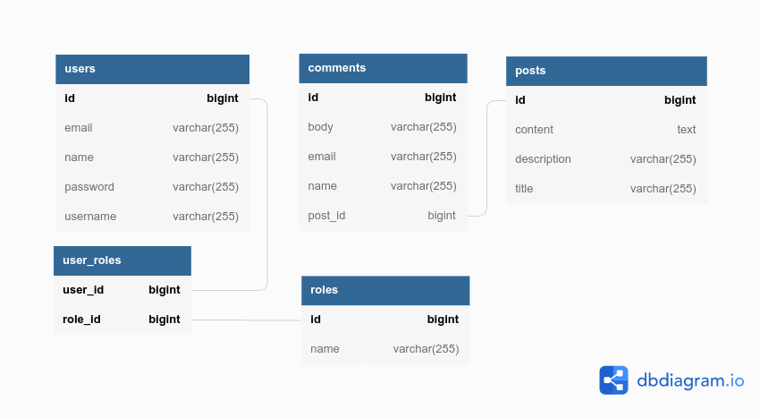

# Tích hợp RESTful cho ứng dụng Blog

## 1. Yêu cầu

Tạo RESTful API cho ứng dụng blog đáp ứng các yêu cầu sau:
- Xây dựng API giúp quản lý bài viết (Post) và bình luận (Comment) theo bài viết. Hệ thống cho phép thêm mới, sửa, xóa, lấy thông tin của bài viết và bình luận tương ứng.
- Truy vấn danh sách bài viết và bình luận có phân trang và sắp xếp.
- Hệ thống đảm bảo định danh và phân quyền người dùng sử dụng spring security.
- Các request phải được bảo mật bằng JSON Web Token

## 2. Phân tích hệ thống
### 2.1 Công nghệ
- Spring boot, RESTful Web Service
- MySQL server, Sring data JPA
- Spring security, JWT
### 2.2 Database
 

     

### 2.3 RESTful routes

- Post

| Method | Path | Mô tả
| --- | --- | --- |
| GET | /api/posts| Lấy danh sách post và comment tương ứng |
| GET | /api/posts/{postId} | Lấy Post |
| POST | /api/posts | Tạo post mới |
| PUT | /api/posts/{postId} | Cập nhật post|
| DELETE | /api/posts/{postId} | Xóa Post |

- Pagging và Sorting  

Request
| Method | Path | Mô tả
| --- | --- | --- |
| GET | /api/posts| Lấy danh sách post và comment tương ứng |

Parameters
| Name | Data type | Required | Mô tả
| --- | --- | --- |--- |
| pageNo | number| optional | Số thứ tự của trang|
| pageSize | number| optional | Kích thước của trang|
| sortBy | string | optional | Sắp xếp theo các trường của Post |
| sortDir | string | optional | Tăng dần hoặc giảm dần, asc hoặc desc |

- Comment
  
| Method | Path | Mô tả
| --- | --- | --- |
| GET | /api/posts/{postId}/comments| Lấy danh sách comment theo post id |
| GET | /api/posts/{postId}/comments/{commentId} | Lấy comment theo id và post id|
| POST | /api/posts/{postId}/comments | Tạo comment mới thuộc post |
| PUT | /api/posts/{postId}/comments/{commentId}  | Cập nhật comment thuộc post|
| DELETE | /api/posts/{postId}/comments/{commentId} | Xóa comment thuộc post|

- Authentication
  
| Method | Path | Mô tả
| --- | --- | --- |
| POST | /api/auth/signin | Đăng nhập |
| POST | /api/auth/signup | Đăng ký |